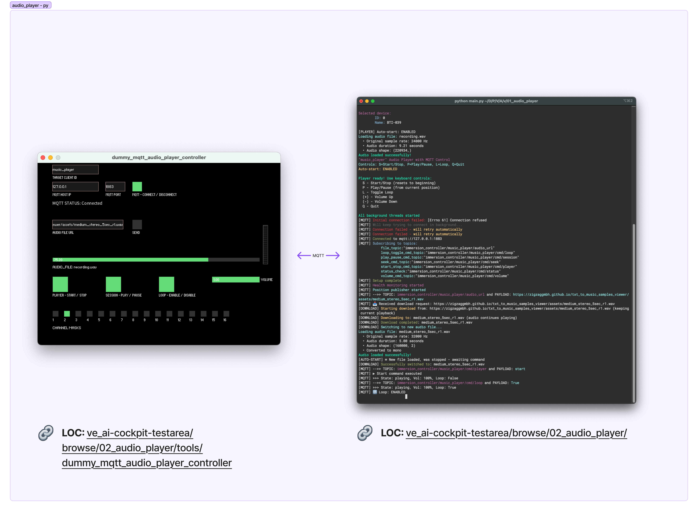

# README

## About

A **cross platform** MQTT based python audio player that responds to MQTT messages to control playback and publishes critical information over MQTT. It can play files at specified sample rates, via specific channels and the self player volume can be dynamically adjusted. It is meant to run headless.

> [!TIP]
> This allows the same project to be cloned, modified and spawned as many independent players uniquely identifiable by a unique client id and controlled respectively while all accessing the same sound device, all via passing a new config file



> [!TIP]
> mqtt based dummy controllers can be found in [dummy_mqtt_audio_player_controller](tools/dummy_mqtt_audio_player_controller)

## Features

### Audio Playback

- **Multi-channel** audio support with configurable channel mapping and dynamic channel mapping during playback
- **Real-time volume control** during playback
- **Loop** functionality for continuous playback
- **Repeat** mode with configurable count and interval (sticky behavior)
- **Seek/jump** to specific time positions
- Support for various sample rates with automatic resampling

### MQTT Integration

- Remote control via MQTT commands
- Real-time state publishing (player status, position, volume)
- Health monitoring with configurable heartbeat
- Remote file downloads from URLs
- Auto-start configuration for seamless operation

### File Management

- Automatic audio file discovery
- Remote file downloads via MQTT
- Smart file switching with playback continuity
- Configurable auto-start behavior

## File Structure

```txt
project/
├── main.py                     # Main application
├── config.yaml                 # Player configuration file
├── pyproject.toml              # uv manageable Python dependencies and project details
├── audio/                      # Test Audio file directory (.wav files ONLY please)
├── logs/                       # Logs will be saved here
├── config/
│   └── config_loader.py        # Configuration loader
├── player/
│   ├── core.py                 # AudioPlayer class
│   ├── utils.py                # Device discovery & utilities
│   └── file_manager.py         # File downloads & management
├── mqtt/
│   └── client.py               # MQTT client & message handler
└── input/
│   └── keyboard.py             # Cross-platform keyboard input handler
├── assets/
├── LICENSE
├── README.md
├── build.py
├── setup.sh
├── setup.bat
└── tools
    ├── 01_config_sound_device.py
    ├── 02_test_sound_device.py
    └── dummy_mqtt_audio_player_controller/
        ├── linux-amd64/
        ├── macos-aarch64/
        ├── windows-amd64/
        └── README.md
```

### Other helper files and directories

1. DIR: [assets](assets): Assets directory for documentation
2. DIR: [audio](audio): This is where the script temporarily stores audio files that are asked of it to download and load and play from
3. DIR: [tools](tools): A directory where some helper scripts and supporting utilities are stored that has been created during development
4. TOOL: [tools/dummy_mqtt_audio_player_controller](tools/dummy_mqtt_audio_player_controller): A simple bidirectional software (Written in Processing and compiled as applications for all 3 platforms) that primarily acts as an MQTT controller for such an headless audio player thus acting as handy GUI controller during testing and development. _This was compiled as an app for easy distribution while testing this main project in isolation_
5. TOOL: [01_config_sound_device.py](tools/01_config_sound_device.py): This is a simple interactive, step by step tool to help the user set the primary sound output device and target playback channels for the audio player by ultimately writing them to a config file ([config.yaml](config.yaml)) from which, the main script can then load the sound device information and use it in the audio player. _Please note that the sound device and channel mask can also be assigned dynamically before playback, via MQTT. More on that below_ (TODO)  
6. TOOL: [02_test_sound_device.py](tools/02_test_sound_device.py): This is just a basic audio player that uses the set player and sound device configurations from the [config.yml](config.yml) to test audio playback, especially output channels. _Note: It is also used by [01_config_sound_device.py](tools/01_config_sound_device.py) to test new configuration, after it finishes writing the new sound device configuration_

## Dependency installation

### Perquisites

Make sure that you have `uv` installed in your OS with specific shell integrations and PATH accessibility. Instructions can be found [here](https://docs.astral.sh/uv/getting-started/installation/).

### Setup

> [!IMPORTANT]
>
> For running the  [audio-player](audio-player) (macOS / Linux) or [audio-player.exe](audio-player.exe) in windows you do not need to go through python dependency setup but you would need to, if you want to run a helper script to have a guided "Sounddevice configuration"

1. Clone the repo

2. Install the dependencies simply typing the cmd below in the root of the project. It creates a project specific virtual environment and installs project specific python version and dependencies

```bash
uv sync
```

3. Activate the virtual environment by using one of the following `source` commands

```bash
source .venv/bin/activate.fish # if your shell is fish (Linux / macOS)
source .venv/bin/activate # if your shell is bash (Linux / macOS)
```

```ps
# if your shell is PowerShell (Win)
.venv\Scripts\activate
```

## Sounddevice configuration (One time only!)

From the previous step, once the venv is activated, do the following:

```bash
python tools/01_config_sound_device.py
```

Follow the prompts

> [!NOTE]
>
> If you know your sound card's system name and total channel count, then you can manually edit the `player:` section of [config.yaml](config.yaml) . You can keep all channels if the channel mask as 1 but make sure that the channel count and the len of channel mask is the same

## Other Configurations

The [config.yaml](config.yaml) file controls all aspects of the player:

### MQTT Configuration

```yml
mqtt:
  broker: "127.0.0.1"                    # MQTT broker address
  port: 1883                             # MQTT port
  client_id: "music_player"              # Unique client identifier
  heartbeat: 'True'                      # Enable health monitoring
  heartbeat_freq: 1                      # Heartbeat interval (seconds)
```

### File Paths

```yml
paths:
  audio_file_dir: "audio"                # Audio files directory
  log_file_dir: "logs"                   # Log files directory
```

### Sound device Configuration (on first execution)

```yml
player:
  device_name: "MacBook Pro Speakers"    # Audio output device (If set to `None` that will use the system default)
  device_sample_rate: 48000              # Target sample rate
  device_channels: 2                     # Output channels
  playback_channel_mask: [1, 0]          # Channel routing [L, R]
  playback_volume_factor: 1              # Initial volume (0.0-2.0)
  auto_start: true                       # Auto-start on file download
```

### How does Channel Masking (according to available channels) work ...?

1. Channel System
    - [0] - No sound (silent)
    - [1] - Sound on the channel

2. Channel System
   - [0, 0] - No sound on either channel (silent)
   - [1, 0] - Sound on left channel only
   - [0, 1] - Sound on right channel only
   - [1, 1] - Sound on both channels (standard stereo)

3. Channel System
   1. [0, 0, 0] - No sound on any channel (silent)
   2. [1, 0, 0] - Sound on channel 1 only
   3. [0, 1, 0] - Sound on channel 2 only

and so on ...

### Understanding Repeat Mode

Repeat mode allows you to play an audio file multiple times with a configurable interval between plays. This is a **sticky behavior** - once set, it persists across multiple playback triggers and file changes.

#### How It Works

1. **Set Repeat Behavior** (passive - doesn't start playback)
   ```bash
   mosquitto_pub -t "/player/cmd/repeat" -m '{"count": 3, "interval": 2}'
   ```
   - `count`: Number of times to play (1-10)
   - `interval`: Seconds to wait between plays (0-30)

2. **Trigger Playback** (now follows repeat behavior)
   ```bash
   mosquitto_pub -t "/player/cmd/player" -m "start"
   # OR load a new file (auto-starts if enabled)
   mosquitto_pub -t "/player/audio_url" -m "http://example.com/audio.wav"
   ```
   Result: Audio plays 3 times with 2 seconds between each play

3. **Sticky Behavior** - Repeat persists for subsequent files
   ```bash
   mosquitto_pub -t "/player/audio_url" -m "http://example.com/newfile.wav"
   ```
   Result: New file also plays 3 times with 2 second intervals

4. **Cancel Repeat** - Return to single-play mode
   ```bash
   mosquitto_pub -t "/player/cmd/repeat" -m '{"count": 0, "interval": 0}'
   ```
   Result: Next playback will play once (or loop if loop is enabled)

#### Behavior Rules

- **Repeat vs Loop**: When repeat is activated, loop mode is automatically disabled. Repeat takes priority.
- **Pause Support**: You can pause/resume during repeat cycles - the interval timer pauses too
- **Loop Re-enabling**: To return to loop mode after using repeat, first cancel repeat, then enable loop
- **State Monitoring**: MQTT status messages include repeat progress (`repeat_current`/`repeat_total`) and state (`playing`/`waiting`/`completed`)


## BEHAVIOR SIMULATION MATRIX:

```txt
INITIAL STATE: stopped, repeat=OFF, loop=OFF

┌─────────────────────────────────────────────────────────────────┐
│ PLAYBACK MODES (Mutually Exclusive)                             │
├─────────────────────────────────────────────────────────────────┤
│ 1. SINGLE PLAY:  repeat=OFF, loop=OFF → play once, stop         │
│ 2. REPEAT MODE:  repeat=ON,  loop=OFF → play N times, stop      │
│ 3. LOOP MODE:    repeat=OFF, loop=ON  → play forever            │
│ ILLEGAL:         repeat=ON,  loop=ON  → NOT ALLOWED             │
└─────────────────────────────────────────────────────────────────┘

┌─────────────────────────────────────────────────────────────────┐
│ COMMAND MATRIX                                                  │
├───────────────┬─────────────┬─────────────┬─────────────────────┤
│ Command       │ repeat=ON   │ loop=ON     │ Result              │
├───────────────┼─────────────┼─────────────┼─────────────────────┤
│ set_repeat    │ UPDATE      │ OFF (force) │ Store params, wait  │
│ set_loop      │ OFF (force) │ UPDATE      │ Enable loop         │
│ send_file     │ PRESERVE    │ PRESERVE    │ Load + auto_start   │
│ start         │ PRESERVE    │ PRESERVE    │ pos=0, play mode    │
│ play          │ PRESERVE    │ PRESERVE    │ Resume from pos     │
│ pause         │ PRESERVE    │ PRESERVE    │ Hold position       │
│ stop          │ PRESERVE    │ PRESERVE    │ pos=0, keep params  │
│ seek          │ PRESERVE    │ PRESERVE    │ Jump position       │
│ volume        │ PRESERVE    │ PRESERVE    │ Change gain         │
└───────────────┴─────────────┴─────────────┴─────────────────────┘
```

#### Example Use Case

> [!Note]
> More on MQTT control and monitor interface, below

```bash
# 1. Configure repeat: play 5 times with 3 second pause between
mosquitto_pub -t "/player/cmd/repeat" -m '{"count": 5, "interval": 3}'

# 2. Load and play alert sound
mosquitto_pub -t "/player/audio_url" -m "http://server/alert.wav"
# → Plays alert 5 times with 3s intervals

# 3. Later, load different alert (repeat behavior persists)
mosquitto_pub -t "/player/audio_url" -m "http://server/urgent.wav"
# → Also plays 5 times with 3s intervals

# 4. Done with repeating alerts, cancel repeat
mosquitto_pub -t "/player/cmd/repeat" -m '{"count": 0, "interval": 0}'

# 5. Load background music with loop
mosquitto_pub -t "/player/cmd/loop" -m "true"
mosquitto_pub -t "/player/audio_url" -m "http://server/music.wav"
# → Plays continuously in a loop
```

## How to run the main player

1. Then run the script

```bash
# First make sure the python version of the venv is 3.12 by typing 'python' and then exiting the interpreter using Ctrl+D  

python main.py                             # Note: This will take config.yml as default config file
# OR
python main.py -c [YOUR_CONFIG_FILE].yaml  # Note: But you can always pass a new config file with -c

# OR 
uv run main.py -c [YOUR_CONFIG_FILE].yaml
```

---

## Building

We wanted standalone binaries that run anywhere without Python installation.

So, we have:

1. [setup.sh](setup.sh) / [setup.bat](setup.bat) - Automated setup: installs `uv`, dependencies, and builds binaries (cross-platform)
2. [build.py](build.py) - Cross-platform binary builder using `PyInstaller`. Creates single-file executables with all dependencies bundled

**Result** - Standalone binaries that run anywhere without Python installation

After building, share the executable:

- ✅ No Python required on target machines
- ✅ No dependency installation needed
- ✅ Single file - just copy and run
- ✅ Cross-platform - works on Windows, macOS, Linux

### One-Command Setup

Mac/Linux:

```bash
chmod +x setup.sh
./setup.sh
```

Windows:

```cmd
setup.bat
```

### Standalone Binary

Mac/Linux:

```bash
./audio-player                                  # It will take config.yml as default config file   
# OR
./audio-player -c [YOUR_CONFIG_FILE].yaml       # Note: you can always pass a new config file with -c ...
```

Windows:

```bash
.\audio-player.exe                              # It will take config.yml as default config file 
# OR
.\audio-player.exe -c [YOUR_CONFIG_FILE].yaml   # Note: you can always pass a new config file with -c ...
# OR
.\audio-player                                  # It will take config.yml as default config file 
# OR
.\audio-player -c [YOUR_CONFIG_FILE].yaml       # Note: you can always pass a new config file with -c ...
```


Manual Build:

```bash
uv run build.py                                 # Create standalone executable
```

---

## MQTT API

### MQTT Commands (subscription topics)

### Player Control

```bash
# Change mask for playback
mosquitto_pub -t "channel_mask_cmd_topic: /{{ mqtt.client_id }}/cmd/channel_mask" -m '[1, 0]'

# Download and load new audio file from a link
mosquitto_pub -t "/{{mqtt.client_id}}/audio_url" -m "http://example.com/audio.wav"

# Use an audio file from an absolute PATH (OS agnostic)
mosquitto_pub -t "/{{mqtt.client_id}}/audio_url" -m "/Users/user/audio/audio.wav"
mosquitto_pub -t "/{{mqtt.client_id}}/audio_url" -m "C:\\Users\\user\\audio\\audio.wav"

# JSON format also supported
mosquitto_pub -t "{{ mqtt.client_id}}/audio_url" -m '{"url": "http://example.com/audio.wav"}'
mosquitto_pub -t "{{ mqtt.client_id}}/audio_url" -m '{"url": "/Users/user/audio/audio.wav"}'
mosquitto_pub -t "{{ mqtt.client_id}}/audio_url" -m '{"url": "C:\\Users\\user\\audio\\audio.wav"}'

# Start/Stop (if auto_start is false)
mosquitto_pub -t "/{{mqtt.client_id}}/cmd/player" -m "start"
mosquitto_pub -t "/{{mqtt.client_id}}/cmd/player" -m "stop"

# Play/Pause
mosquitto_pub -t "/{{mqtt.client_id}}/cmd/session" -m "play"
mosquitto_pub -t "/{{mqtt.client_id}}/cmd/session" -m "pause"

# Loop Toggle
mosquitto_pub -t "/{{mqtt.client_id}}/cmd/loop" -m "true"
mosquitto_pub -t "/{{mqtt.client_id}}/cmd/loop" -m "false"

# Repeat Mode (sticky behavior)
# Set repeat: play audio N times with interval between plays
mosquitto_pub -t "/{{mqtt.client_id}}/cmd/repeat" -m '{"count": 3, "interval": 2}'

# Then trigger playback (repeat behavior persists across new files)
mosquitto_pub -t "/{{mqtt.client_id}}/cmd/player" -m "start"
# OR load new file (will also repeat)
mosquitto_pub -t "/{{mqtt.client_id}}/audio_url" -m "http://example.com/audio.wav"

# Cancel repeat mode (return to single-play)
mosquitto_pub -t "/{{mqtt.client_id}}/cmd/repeat" -m '{"count": 0, "interval": 0}'

# Absolute volume (0.0-1.0)
mosquitto_pub -t "/{{mqtt.client_id}}/cmd/volume" -m "0.5"

# Relative volume
mosquitto_pub -t "/{{mqtt.client_id}}/cmd/volume" -m "+"
mosquitto_pub -t "/{{mqtt.client_id}}/cmd/volume" -m "-"

# Seek to time (MM:SS format)
mosquitto_pub -t "/{{mqtt.client_id}}/cmd/seek" -m "01:30"

# Seek to seconds
mosquitto_pub -t "/{{mqtt.client_id}}/cmd/seek" -m "90"

# Request current status
mosquitto_pub -t "/{{mqtt.client_id}}/cmd/status" -m "check"
```

### MQTT Status Topics

The player publishes status updates to these topics:

#### Player State

**Topic**: `service/{{mqtt.client_id}}/status/state`

**Payload**: (example)

```json
{
  "state": "stopped", // started, stopped, playing, paused (download states are internally managed not broadcasted)
  "loop_enabled": false, 
  "volume": 1, 
  "volume_percentage": 100, 
  "auto_start": true,
  // When repeat mode is active, additional fields appear:
  "repeat_enabled": true,
  "repeat_current": 2,      // Current iteration (1-based)
  "repeat_total": 3,        // Total repeat count
  "repeat_interval": 2.0,   // Interval in seconds
  "repeat_state": "playing" // "playing", "waiting", or "completed"
}
```

Responds on state change, volume change, loop state change, repeat state change, or when requested the current state by `immersion_controller/{{ mqtt.client_id }}/cmd/status` (payload: anything)

---
**Topic**: `service/{{mqtt.client_id}}/status/audio/position`

**Payload**: (example)

```json
{
  "position": "00:04", 
  "total_duration": "00:05", 
  "percentage": 98.0, 
  "current_file": "medium_stereo_5sec_r1.wav"
}
```

While the player is playing ...

---

**Topic**: `service/{{ mqtt.client_id }}/status/audio/level`

**Payload**: (example)

```json
{
  "level": 0.014,
  "timestamp": 1749777418.266134
}
```

While the player is playing ... (freq and enablement controlled in config.yml)

---

**Topic**: `service/{{mqtt.client_id}}/status/health`

**Payload**: (example)

```json
{
  "status": "online", // offline
  "client_id": "{{mqtt.client_id}}"
}
```

Broadcasts at a certain frequency, defined in [config.yml](config.yaml) (`heartbeat: 'True'` & `heartbeat_freq: 1`)

---

## Extending (Adding Features)

- New MQTT commands: Modify [mqtt/client.py](mqtt/client.py) and [config.yml](config.yaml)
- Audio effects: Extend [player/core.py](player/core.py)

---

## Troubleshooting

### Common Issues

#### Audio device not found

```bash
# List available devices
python -c "import sounddevice as sd; print(sd.query_devices())"
```

#### MQTT connection failed

- Verify broker address and port in [config.yaml](config.yaml)
- Check if MQTT broker is running: `mosquitto_pub -t test -m "hello"`

#### No audio files found

- Ensure `.wav` files are in the audio/ directory
- Check file permissions and format compatibility

#### Performance issues

- Adjust `blocksize` in [player/core.py](player/core.py) for your system
- Monitor CPU usage and buffer underruns

---

## License

[MIT](LICENSE)

## Credit

```txt
Saurabh Datta
zigzag.is
datta@zigzag.is
hi@dattasaurabh.com
2025, Berlin
```

## Acknowledgments

1. Built with sounddevice for audio playback and soundfile for audio loading
2. MQTT communication via paho-mqtt
3. Audio processing with numpy and scipy